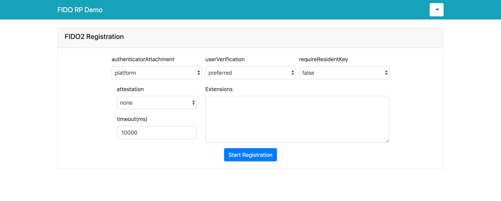

# Quado FIDO2/WebAuthn Relying Party Sample

This is a sample code for understanding how to integrate Quado in your relying party.
Server side code is written in Express.js and front side code is written in pure javascript.

**NOTE:** For simplicity, this sample uses localstorage of browser in order to manage users. Thus, username, password and uid are saved in browser. In a production environment, you should implement user management functionality on server side.

## Live Demo

**[VIEW LIVE DEMO](https://demo.quado.io)**

## Supported Browser

| </br> Microsoft Edge | </br> Mozilla Firefox | </br> Google Chrome | </br> Safari
| --- | --- | --- | --- |
| 18+ | 60+ | 67+ | 13+ |

## Setup

### Register new relying party

First of all, you need to sign up [Quado console](https://quado.io) to register new relying party.
Please refer to this [document](https://doc.quado.io/quick_start/#register-new-relying-party) for more details.

Set the parameters below on "CONFIGURATION" page of Quado console.

|  Parameter  |  Value |
| ---- | ---- |
|  Allowed domain  |  localhost  |
|  Allowed origins  |  http://localhost:2000  |

**NOTE:** If you run this server in another domain, change these parameters according to your environment.

You can find `API key` and `API endpoint` in the bottom of `CONFIGURATION` page. These values will be used later.

### Run

Install dependencies.

``` bash
# In case of yarn
yarn install

# In case of npm
npm install
```

Specify your `API key` and `API endpoint` in `app.js` file.


``` javascript
const API_KEY = "YOUR_API_KEY"
const ENDPOINT = "https://api.quado.io/webauthn/api/v1"
```

Start web server and you can access `http://localhost:2000`.

``` bash
node app.js
```

## Usage

### Registration

After sign up and click "Register new FIDO2 device" button, you can see registration page below.



Click "Start Registration" to register new FIDO key.

**NOTE:** The optional `authenticatorAttachment` attribute filters eligible authenticator by type.
The value “platform” indicates a platform authenticator, such as Windows Hello or MacOS's TouchID.
The value "cross-platform" value indicates a roaming authenticator, such as a security key.

Once your FIDO key was registered, you can see registered key from "/top.html".

### Authentication

After registration, you can try authentication from "/auth.html".


## License

[](http://badges.mit-license.org)

- **[MIT license](http://opensource.org/licenses/mit-license.php)**
- Copyright 2019 © <a href="https://www.quado.io" target="_blank">Quado, Inc.</a>.
