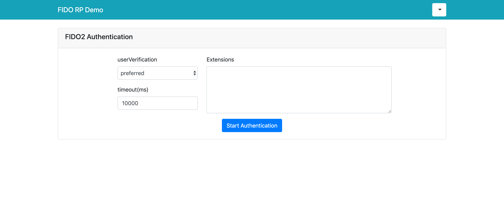

# Getting Started
This is a sample code for understanding how to integrate Quado in your relying party.
Server side code is written in Express.js and front side code is written in pure javascript.

First of all, you need to sign up [Quado console](https://quado.io) to get API key for your relying party.Please refer to [Configure Quado](https://doc.quado.io/setting\_up\_quado/#get-api-key) for more details.

**[VIEW LIVE DEMO](https://demo.quado.io)**

## Note

For simplicity, this sample uses browser's localstorage to manage users. Thus, username and password are saved in browser.
In a production environment, you should implement user management functionality on server-side.

## Setup

Install dependencies.

``` bash
# In case of yarn
yarn install

# In case of npm
npm install
```

Specify your API key in `app.js` file.

``` javascript
const API_KEY = "YOUR_API_KEY"
```

Start web server and you can access `http://localhost:2000`. 

``` bash
node app.js
```
**Confirm that this server URL corresponds with URL which you specified in Quado console.**

## Registration
After sign up and click "Register new FIDO2 device" button, you can see registration page below.


Click "Start Registration" to register new FIDO key.

**NOTE:** The optional `authenticatorAttachment` attribute filters eligible authenticator by type. 
The value “platform” indicates a platform authenticator, such as Windows Hello or MacOS's TouchID.
The value "cross-platform" value indicates a roaming authenticator, such as a security key. 

Once your FIDO key was registered, you can see registered key from "/top.html".


## Authentication
After registration, you can try authentication from "/auth.html".


